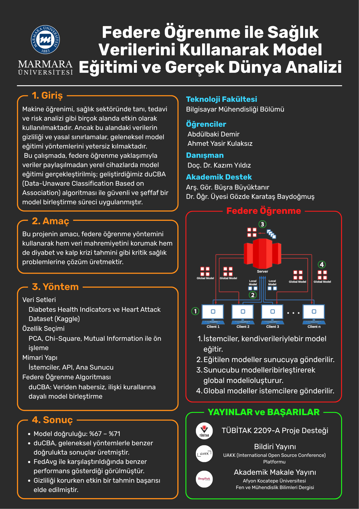

# Federe Öğrenme ile Sağlık Verilerini Kullanarak Model Eğitimi ve Gerçek Dünya Analizi

## 👥 Proje Ekibi

- Abdülbaki Demir
- Ahmet Yasir Kulaksız

**Danışmanlar:**

- Doç. Dr. Kazım Yıldız
- Arş. Gör. Büşra Büyüktanır
- Dr. Öğr. Üyesi Gözde Karataş Baydoğmuş

---

## 🧠 Proje Hakkında

Bu proje, sağlık verilerinde mahremiyeti koruyarak merkezi olmayan makine öğrenimi eğitimi gerçekleştirmek amacıyla federe öğrenme mimarisi kullanılarak geliştirilmiştir. Diyabet tahmini için Kaggle platformundan alınan [*Diabetes Health Indicators Dataset*](https://www.kaggle.com/datasets/alexteboul/diabetes-health-indicators-dataset) ve kalp hastalığı tahmini için [*Heart Attack Dataset*](https://www.kaggle.com/datasets/omarfayez/heart-attack-data) kullanılmıştır. Proje kapsamında `duCBA` adlı ilişkisel sınıflandırmaya dayalı federatif model birleştirme algoritması uygulanmıştır.

---

## 🎯 Amaç

- Sağlık verilerinin gizliliğini koruyarak merkezi sunuculara veri göndermeden makine öğrenmesi modelleri geliştirmek
- duCBA algoritması ile farklı istemcilerde eğitilen CBA tabanlı modelleri birleştirerek merkezi bir global model üretmek
- Uygulamayı gerçek dünya koşullarında test ederek sistemin güvenilirliğini ve performansını ölçmek

---

## 🛠️ Kullanılan Teknolojiler

- Python 3.8
- Google Cloud Platform (GCP)
- Pandas, NumPy, Scikit-learn, Matplotlib, Seaborn
- pyfim, pyarc, websockets, pickle

---

## 📊 Kullanılan Veri Seti

**Diabetes Health Indicators Dataset**

- 70.692 satır, 22 sütun
- Bağımlı değişken: `Diabetes_binary`
- Bağımsız değişkenler: HighBP, HighChol, CholCheck, BMI, Smoker, Stroke,
  HeartDiseaseorAttack, PhysActivity, Fruits, Veggies,
  HvyAlcoholConsump, AnyHealthcare, NoDocbcCost, GenHlth,
  MentHlth, PhysHlth, DiffWalk, Sex, Age, Education, Income

**Heart Attack Dataset**

- 319.795 satır, çeşitli kategorik ve sayısal değişken
- Bağımlı değişken: HeartDisease
- Bağımsız değişkenler: BMI, Smoking, AlcoholDrinking, Stroke, PhysicalHealth, MentalHealth, DiffWalking, Sex, AgeCategory, Diabetic, PhysicalActivity, GenHealth, SleepTime, Asthma, KidneyDisease, SkinCancer

---

## 📈 Elde Edilen Sonuçlar

- Global model doğruluk oranı: **%70**
- duCBA algoritması, geleneksel yöntemlerle benzer doğruluk değerleri verirken veri gizliliğini korur.
- Confusion matrix ve F1-score sonuçları, modelin dengeli performans gösterdiğini ortaya koymuştur.

---

## ⚙️ duCBA Algoritması  (Büşra hoca repo linki ver)op1

duCBA, istemcilerde eğitilen CBA tabanlı modelleri merkezi sunucuda birleştirerek nihai global modeli oluşturur.

- Kurallar destek (support) ve güven (confidence) metrikleriyle sıralanır.
- Aynı içerikli ama farklı etiketli kurallarda daha yüksek destek değerine sahip olan tercih edilir.
- Şeffaf karar mekanizması ile XAI (Açıklanabilir Yapay Zeka) ilkelerine uygundur.

---

## 📚 Yaygın Etki & Katkı

- **TÜBİTAK 2209-A Proje Desteği**
- **Bildiri Yayını:** UAKK (International Open Source Conference) Platformu
- **Akademik Makale Yayını:** Afyon Kocatepe Üniversitesi Fen ve Mühendislik Bilimleri Dergisi

---

## 🚀 Uygulamanın Kurulumu ve Çalıştırılması

### 1. Ortam Gereksinimleri

```bash
Python >= 3.8.10
pip >= 21.x
```

### 2. Ortak Kütüphanelerin Kurulumu

```bash
pip install -r requirements.txt
```

**requirements.txt** içeriği:

```text
numpy
pandas
scikit-learn
flask
requests
websockets
pyfim
pyarc
pickle-mixin
```

---

### 3. Main Server'ı Başlatma

```bash
cd server
python server.py
```

---

### 4. API Sunucusunu Başlatma

```bash
cd API
python api.py
```

---

### 5. İstemcileri (Client) Başlatma

```bash
cd client
python client.py
python client.py
```

---

### 6. Model Eğitimi Süreci

1. Her istemci lokal verisinde CBA ile model eğitir.
2. API, modelleri toplar ve ana sunucuya iletir.
3. Main Server `duCBA` ile modelleri birleştirir.
4. Global model tekrar istemcilere gönderilir.
5. Bu süreç api tarafında belirlenen iterasyon sayısı boyunca döngüsel devam eder.

---

## 📂 Önerilen Dosya Yapısı

```
project-root/
│
├── client/               # Yerel model eğitim kodları
├── api/                  # API sunucu kodları
├── server/               # duCBA birleşim kodları
├── client/data/          # Kaggle veri seti
└── README.md             # Bu dosya
```

---

# Ana Bileşenler ve İşlevleri

## Main Server (Ana Sunucu) – Kod Açıklaması

Main Server, federated learning mimarisinde istemcilerden gelen yerel modelleri birleştirerek global modeli oluşturur. Aşağıda bu dosyadaki temel bileşenlerin kısa açıklaması yer almaktadır:

---

### 1. **WebSocket Sunucusu**

- `websockets` kütüphanesi ile `7896` portunda çalışır.
- `async def handler()` fonksiyonu gelen bağlantıları dinler.
- İstemcilerden gelen modeller JSON formatında alınır.

### 2. **Model Birleştirme – duCBA**

- Her istemciden gelen model (birliktelik kurallar listesi) `duCBA` algoritması ile birleştirilir.
- İşleyiş:
  - Her kural için `support` ve `confidence` değerleri yeniden hesaplanır.
  - Aynı içerikli ama farklı etiketli kurallar karşılaştırılır.
  - Güven/öncelik sırasına göre sıralanır, eşitlik durumunda orijinal sıraya göre yerleştirilir.

### 3. **Modeli API’ye Geri Gönderme**

- Oluşturulan global model JSON formatında API sunucusuna websocket ile geri gönderilir.
- API sunucusu bu modeli istemcilere dağıtır.

---

## 🔗 API Server – Kod Açıklaması

API sunucusu, istemciler ve ana sunucu arasında **köprü görevi** görür. Gelen yerel modelleri ana sunucuya iletir, birleşmiş global modeli tekrar istemcilere dağıtır.

### 1. **Quark Sunucusu (HTTP)**

- Port: `5000`
- İstemcilerden gelen HTTP POST isteklerini `/upload-model` gibi bir endpoint üzerinden alır.
- Her model `JSON` formatında alınır ve bellekte sırayla biriktirilir.

### 2. **Model Havuzu Yönetimi**

- İstemcilerden belirli sayıda model toplandığında (`örneğin 10 model`), bu modeller ana sunucuya websocket üzerinden gönderilir.
- Toplanan modeller `queue` veya liste yapısında saklanır.

### 3. **Ana Sunucu ile WebSocket Bağlantısı**

- Port: `7896` üzerinden `main server` ile bağlantı kurar.
- Toplanan tüm modeller bu bağlantı üzerinden gönderilir.
- `duCBA` algoritması ile birleştirilen model yine websocket üzerinden alınır.

#### 4. **Global Modeli Dağıtma**

- Alınan global model, kayıtlı istemcilere HTTP üzerinden dağıtılır.
- Gerekirse istemciler bu modeli indirerek yerel eğitimlerine devam eder.

---

## 🧑‍💻 Client (İstemci) – Kod Açıklaması

İstemciler, kendi yerel verileri üzerinde model eğitimi yaparak merkezi sisteme **veri göndermeden** sadece model sonuçlarını iletir. Böylece veri gizliliği korunur ve federated learning prensiplerine uygun hareket edilir.

### 1. **Model Eğitimi (CBA)**

- `CBA (Classification Based on Association)` algoritması kullanılır.
- Kütüphaneler: `pyfim`, `pyarc`
- Parametreler:
  - `support` = 0.2
  - `confidence` = 0.5

### 2. **Modelin API’ye Gönderilmesi**

- Eğitilen modeldeki kurallar, JSON formatına dönüştürülerek Flask tabanlı API sunucusuna HTTP POST ile gönderilir.
- Gönderim sonrasında istemci beklemeye geçer.

### 3. **Global Modelin Alınması**

- API sunucusu tarafından birleştirilmiş model tekrar istemciye gönderilir.
- Yeni gelen modelle eğitim süreci bir üst turda devam eder (iteratif süreç).

### 🔁 Federated Learning Süreci – Genel Akış

1. **İstemciler**, kendi yerel verileriyle `CBA` algoritması kullanarak model eğitir.
2. Eğitilen modeller, **API sunucusuna** HTTP POST ile gönderilir.
3. **API**, belirli sayıda modeli topladığında, bu modelleri **ana sunucuya** (main server) WebSocket üzerinden iletir.
4. **Ana sunucu**, `duCBA` algoritmasıyla gelen modelleri birleştirerek bir **global model** oluşturur.
5. Global model, tekrar **API** aracılığıyla tüm istemcilere dağıtılır.
6. İstemciler, bu yeni modeli alarak bir sonraki turda eğitimlerine devam eder.
7. Bu döngü, belirlenen iterasyon (örneğin 10 tur) boyunca devam eder.

# Proje Afişi



